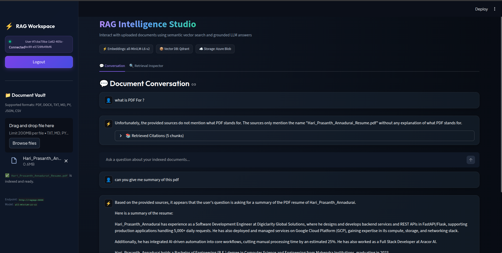
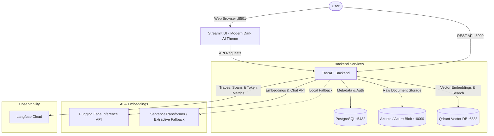

# ⚡ RAG Chat Intelligence Studio

A full-stack, enterprise-ready **Retrieval-Augmented Generation (RAG)** application powered by **FastAPI**, **Qdrant Vector Database**, **Azure Blob Storage**, **PostgreSQL**, and a modern **Streamlit UI**.

Features grounded document Q&A, multi-format text ingestion (PDF, DOCX, TXT, MD, CSV, JSON), instant auto-indexing, semantic vector search, and AI answer synthesis powered by **Hugging Face** serverless inference.

<p align="center">
  
</p>

---

## 🏗️ Architecture



---

## ✨ Features

- **🚀 FastAPI Backend:** High-performance asynchronous API with JWT authentication, dependency injection, and automatic OpenAPI documentation.
- **🎨 Modern Dark AI Streamlit UI:** Sleek glassmorphic interface with real-time status indicators, collapsible citation cards with relevance scores (`Match: 0.89`), and clean workspace controls.
- **📄 Multi-Format Ingestion:** Native extraction for **PDF** (`pypdf`), **DOCX** (`python-docx`), Markdown, Plain Text, CSV, JSON, and Python files.
- **⚡ Instant Auto-Indexing:** Drop any document into the sidebar uploader to trigger automatic extraction, chunking, and vector indexing—no manual button click required.
- **🧠 Hugging Face AI Integration:**
  - **Embeddings:** High-throughput batch vectorization using Hugging Face's serverless Inference API with `sentence-transformers/all-MiniLM-L6-v2` (384 dimensions) and local fallback.
  - **Grounded Q&A Generation:** Answers synthesized with `meta-llama/Llama-3.2-3B-Instruct` (or custom models), citing retrieved chunks inline (`[Source 1]`).
- **🔍 Vector Retrieval Inspector:** Inspect raw vector similarity matches directly from Qdrant without running LLM synthesis.
- **🔭 Langfuse Observability & Tracing:** Full end-to-end telemetry across vector search, document embedding extraction, LLM answer generation, token usage, latency, and direct trace links in the UI.
- **🐳 Unified Docker Architecture:** Single consolidated [Dockerfile](file:///home/hari/projects/llm-challenge/Dockerfile) powering both the API and UI services via Docker Compose command overrides.
- **📦 Relational & Blob Persistence:** PostgreSQL for users, document records, and conversations; Azure Blob Storage (or Azurite emulator) for document binaries.

---

## 🔭 Observability & LLM Tracing

Integrated with **Langfuse Cloud** for real-time monitoring of RAG execution graphs, retrieval steps, token usage, and latency:

<p align="center">
  
</p>

---

## 🚀 Quick Start with Docker Compose (Recommended)

### 1. Prerequisites
- [Docker](https://docs.docker.com/get-docker/) & Docker Compose
- [uv](https://docs.astral.sh/uv/) (optional, for local development)

### 2. Clone and Configure
```bash
git clone https://github.com/hariz723/llm-challenge.git
cd llm-challenge

# Copy environment file
cp .env.example .env
```

Edit `.env` to supply your configuration:
```env
# Database
POSTGRES_USER=hari
POSTGRES_PASSWORD=postgres
POSTGRES_DB=rag_db
POSTGRES_HOST=db
POSTGRES_PORT=5432

# Security
SECRET_KEY=your-secure-secret-key
ALGORITHM=HS256
ACCESS_TOKEN_EXPIRE_MINUTES=30

# Service URLs (for Docker Compose)
API_BASE_URL=http://ragapp:8000
AZURE_STORAGE_CONNECTION_STRING=DefaultEndpointsProtocol=http;AccountName=devstoreaccount1;AccountKey=Eby8vdM02xNOcqFlqUwJPLlmEtlCDXJ1OUzFT50uSRZ6IFsuFq2UVErCz4I6tq/K1SZFPTOtr/KBHBeksoGMGw==;BlobEndpoint=http://azurite:10000/devstoreaccount1;

# Qdrant Vector DB
QDRANT_HOST=qdrant
QDRANT_PORT=6333

# Hugging Face Settings
HF_API_KEY=hf_your_huggingface_api_token
HF_EMBEDDING_MODEL=sentence-transformers/all-MiniLM-L6-v2
HF_CHAT_MODEL=meta-llama/Llama-3.2-3B-Instruct

# Langfuse Observability
LANGFUSE_PUBLIC_KEY=pk-lf-...
LANGFUSE_SECRET_KEY=sk-lf-...
LANGFUSE_BASE_URL=https://us.cloud.langfuse.com
```

### 3. Launch the Stack
```bash
make dev-run
```

All 5 services will start up:
- 🌐 **Streamlit UI:** [http://localhost:8501](http://localhost:8501)
- 📚 **FastAPI Swagger Docs:** [http://localhost:8000/docs](http://localhost:8000/docs)
- 🔍 **Qdrant Vector Dashboard:** [http://localhost:6333/dashboard](http://localhost:6333/dashboard)
- 🗄️ **PostgreSQL:** `localhost:5432`
- ☁️ **Azurite Blob Storage:** `localhost:10000`

### 4. Run Migrations
```bash
make migrate
```

---

## 💻 Local Development (Without Docker)

If you prefer to run services natively:

1. **Install dependencies:**
   ```bash
   make setup
   ```
2. **Configure `.env` for local access:**
   ```env
   POSTGRES_HOST=localhost
   API_BASE_URL=http://localhost:8000
   AZURE_STORAGE_CONNECTION_STRING=DefaultEndpointsProtocol=http;AccountName=devstoreaccount1;AccountKey=...;BlobEndpoint=http://localhost:10000/devstoreaccount1;
   ```
3. **Start FastAPI:**
   ```bash
   make run
   ```
4. **Start Streamlit UI:**
   ```bash
   uv run streamlit run src/ui/app.py
   ```

---

## 🛠️ Makefile Commands

| Command | Description |
| :--- | :--- |
| `make dev-run` | Build and launch all services via Docker Compose in the background |
| `make dev-stop` | Stop all running Docker containers |
| `make dev-down` | Stop and remove Docker containers and networks |
| `make dev-build` | Rebuild Docker images without cache |
| `make dev-logs` | Tail real-time logs from all running containers |
| `make migrate` | Apply database migrations via Alembic |
| `make format` | Format and lint code using `ruff` and `black` |
| `make setup` | Create virtual environment and install dependencies locally |

---

## 📡 REST API Reference

The interactive documentation is always accessible at `http://localhost:8000/docs`.

### Authentication
| Method | Endpoint | Description |
| :--- | :--- | :--- |
| `POST` | `/auth/api/register` | Register a new user account |
| `POST` | `/auth/api/login` | Authenticate and obtain JWT access token |
| `GET` | `/auth/api/me` | Retrieve profile of currently authenticated user |

### Documents & RAG
| Method | Endpoint | Description |
| :--- | :--- | :--- |
| `POST` | `/documents/api/upload` | Upload document (PDF, DOCX, TXT, etc.), parse, chunk, embed, and store in Qdrant |
| `POST` | `/documents/api/search` | Search vector chunks by semantic similarity |
| `POST` | `/documents/api/chat` | Ask grounded questions with synthesized LLM answers and source citations |
| `GET` | `/` | Health check endpoint |

---

## 📄 License
MIT License. Feel free to use and adapt for your own projects.